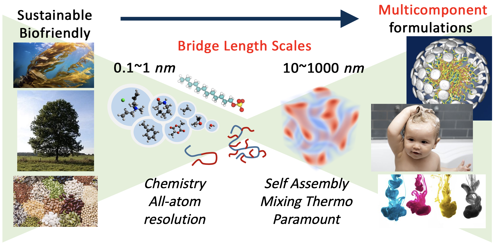

# Welcome to Sim-Utils

A full stack set of tools for a full AA->field theory workflow!
This enables the study of systems from the Angstrom (chemical) scale to micrometer scale.

# Contents
We will cover:

1. [Setting up particle simulations](md/index.md)
2. [Coarse graining](cg/index.md)
3. Running [field theory](fieldtheory/index.md)
4. [Case studies](casestudies/index.md)

# Deprecated
1. Consider an [introduction](intro.ipynb)

