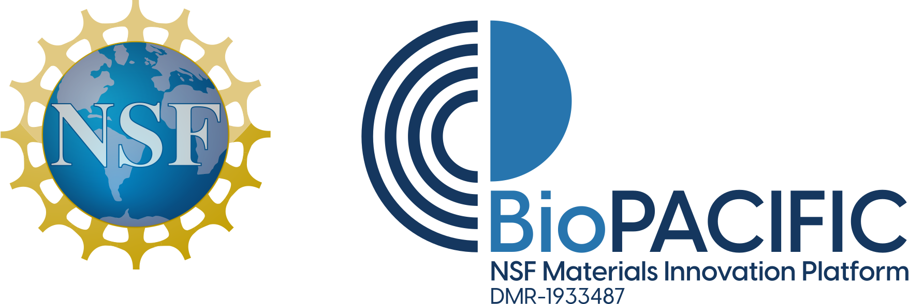

# Welcome to AA2FTS

A full stack set of tools for a simulation workflow that bridges all-atom and field theoretic models!

This enables the study of systems from the Angstrom (chemical) scale to micrometer scale, and bridging complementary engineering design problems of tailoring chemical detail molecules to optimize macroscopic physical properties.

These guides, tools, and resources are being offered as part of the [BioPACIFIC Materials Innovation Platform](https://biopacificmip.org/).

Curious how our simulation tools can help you solve your biomaterial design problems? Contact us!

## Tutorials and guides
1. [Software and Installation](logistics.md)
2. [Case studies](tutorials/index.md): tutorials, organized by system.
3. [Best Practices](tutorials/bestpractices.md): coarse graining advice, organized by physical considreations.
4. [Theory](theory/index.md) 
5. [Running Simulations](index.md)
6. [API Reference]

## References
1. [Getting started: installation and logistics](logistics.md)
2. [Publications and Talks](publications.md)

---
AA2FTS is made available as part of the NSF BioPACIFIC Materials Innovation Platform (DMR-1933487), dedicated to enabling data-driven discovery and scalable production of bio-derived building blocks and polymers with enhanced materials properties. 

{: style="height:150px;width:450px"}