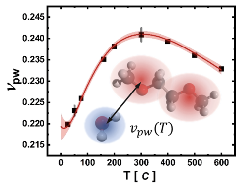
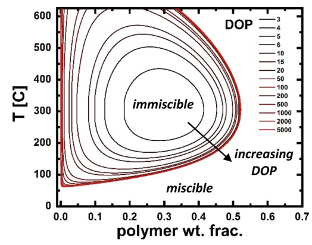

# Polyethylene Oxide (PEO)
(example code under construction)

Using the same concepts as in the [dodecane](../dodecane/index.md) example, a model for PEO can be coarse grained at multiple temperatures. The resulting coarse grained model can be used, for example, with the mean field approximation to rapidly estimate free energies and propensities for macroscopic phase separation.

Following experimental procedures where cloud points were determined by heating fixed-volume containers up from 25C, water-PEO models were created holding their self-repulsions $\beta u_{ii}$ constant, thus holding molecular volumes and densities constant. Subsequently, the non-dimensionalized water-polymer repulsive interaction $\beta v_{pw}$ was determined as a function of T:

{: style="height:283px;width:361px"}

The increased repulsion at intermediate T leads to phase separation, while at very low and high temperatures the repulsion is moderate enough to result in miscible polymer-water solutions:

{: style="height:288px;width:367px"}

The above figures were reproduced from [Sherck et al. 2020](https://pubs.acs.org/doi/10.1021/acsmacrolett.1c00013). 