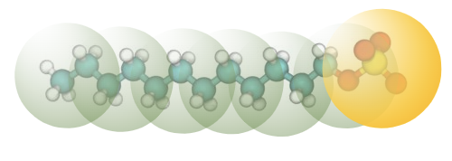
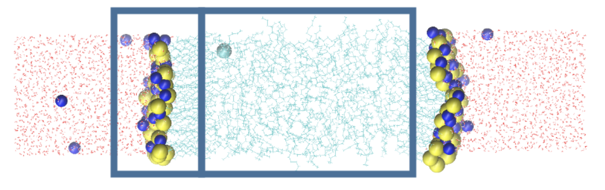

# SDS
SDS forms microstructures (micelles) at most accessible simulation conditions. This presents some interesting questions in its modeling. 

This case study uses the following coarse-grained mapping:

{: style="height:89px;width:250px"}

where every 2 tail carbon beads are grouped to a single bead, and the entire $SO_4^-$ head group is mapped to a single bead.

The case study also builds off of [water](../water/index.md), [dodecane](../dodecane/index.md), and [NaCl](../salt/index.md) interactions derived following previous case studies. As outlined in the [theoretical considerations]("bestpractices.md"), this takes some care in choosing a coarse graining ensemble. For reproducibile structuring we deposit SDS at a dodecane-water interface:

{: style="height:106px;width:334px"}

(The bounding boxes above outline the dodecane region sandwiched between two SDS interfacial layers.)

Code can be found in the [repository](https://github.com/EqualAPriori/sim-utils/tree/scout/docs/tutorials/SDS). See the [jupyter notebook](SDS.ipynb) implementing this in coarse graining. The main new feature being done is the addition of a surface area constraint:

```python
Az = sim.measure.Az(Sys0,axis=2)
Az_target = 18.8556366
Sys0.Measures.append(Az)
Opt0.MinReweightFrac = 0.25
StageCoefsA = [100.0,100.0]
UDist0 = Opt0.AddPenalty(Az, Az_target, MeasureScale = 1., Coef=1.e-80)
```

To run with the constraints, the optimization command is now:

```python
Opt0.RunStages(StageCoefs = StageCoefsA, LagMult0=10.0)
```
