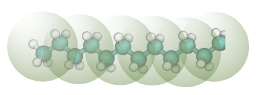

# Dodecane
Dodecane is a first case study involving [bonding](tutorials/bonded.md), and its interactions with water is an example of coarse graining an immiscible molecule pair.

This case study uses the following coarse-grained mapping:

{: style="height:79 px;width:217px"}

And it assumes that [water](tutorials/water/index.md) interactions have already been derived following previous case study. 

The [bulk dodecane](dodecane.ipynb) notebook introduces how to coarse grain with bonded interactions, while the [dodecane-water](dodecane-water.ipynb) notebook describes how to coarse grain from a segregated dodecane-water system and appropriate barostatting.