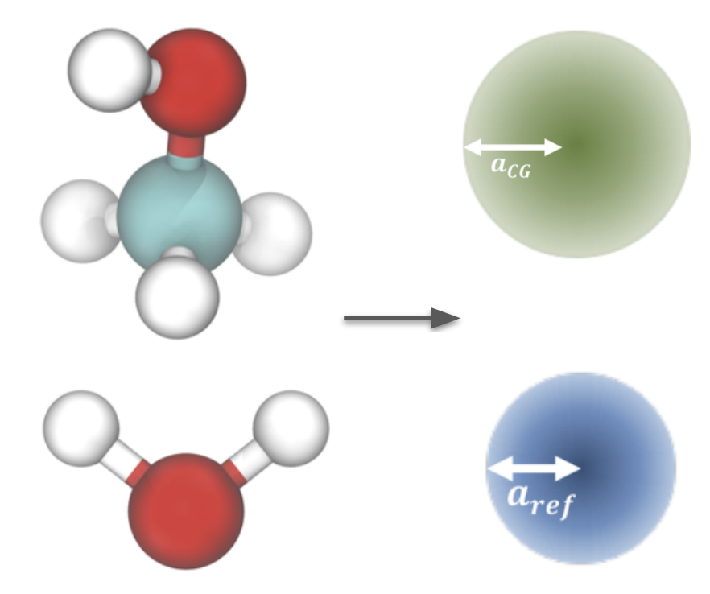

# Methanol-Water
Dodecane is a first case study involving multiple bead types, and its interactions with water is an example of coarse graining an immiscible molecule pair.

This case study uses the following coarse-grained mapping:

{: style="height:369px;width:441px"}

And it assumes that water interactions have already been derived following previous [case study](tutorials/water/index.md), and that methanol has been derived in an analogous fashion using the same [$P_{cg}$](../explicit-solvent-pref.md) as the water system.

As outlined in the [theoretical considerations]("bestpractices.md"), coarse graining a mixture takes some care in choosing a coarse graining ensemble. To this end, we use the [external potential ensemble](https://aip.scitation.org/doi/full/10.1063/5.0022808), easily implemented by applying a sinusoidal potential to one of the species (in this case, water) to force a density response.

Code can be found in the [repository](https://github.com/EqualAPriori/sim-utils/tree/scout/docs/tutorials/methanol_water). The [methanol-water](methanol_water.ipynb) notebook introduces how to obtain thermodynamically faithful coarse grained methanol-water interactions using the [external potential ensemble](https://aip.scitation.org/doi/full/10.1063/5.0022808).

