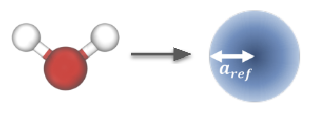

# Water
Water provides a case study in understanding the [main interaction model](../explicit-solvent-pref.md) underlying simulations suitable for running field theory.

We coarse grain water using a 1 bead model:

{: style="height:111px;width:305px"}

See [this notebook](water.ipynb) and the [repository](https://github.com/EqualAPriori/sim-utils/tree/scout/docs/tutorials/water) for example code coarse graining water at $25^o$C. It fixes the water smearing radius to $a_w=0.3107$nm $=\rho_w^{-1/3}$, and determines a suitable repulsion strength $u_w$.

The example code uses the `sim-utils` package and templates to build a system. If building a system from scratch (e.g. after following the main steps in [this guide](../../cg/index.md])), under the hood the most critical part is constructing interaction potential and filter to use the [recommended Gaussian interaction](../explicit-solvent-pref.md):

```python
filter = sim.atomselect.PolyFilter([atom_type_w,atom_type_w], Bonded=False)
potential_ww = sim.potential.LJGaussian(sys, Cut = 3.0,
                     Filter = filter_aa_nonbond,
                     Epsilon = 0.0, Sigma = 1.0, B = 1.0, Kappa=1.0, Dist0=0.0,
                     Shift = True, Label = "LJG")
sys.append(potential_ww)
```

All other steps from [this guide](../../cg/index.md] then apply, including running the optimization.